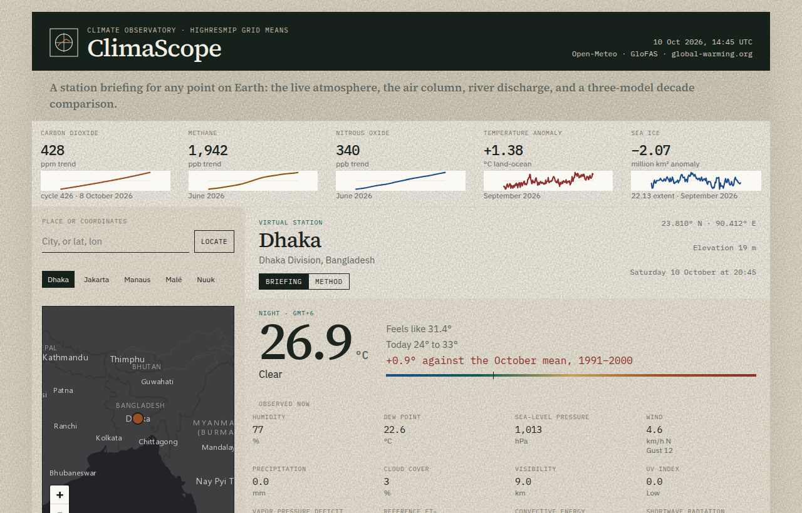

# ClimaScope

## Station briefing for any point on Earth

[](https://naomi197.github.io/climascope/)
[](https://github.com/naomi197/climascope/releases/latest/download/ClimaScope.apk)
[](LICENSE)

ClimaScope puts four records on one sheet: the live atmosphere, the air column, GloFAS river discharge, and a three-model HighResMIP comparison of 1991–2000 with 2041–2050. The same ensemble can be imported without the interface.

Developer: Alireza Sani · [alirezafazeli@live.com](mailto:alirezafazeli@live.com)

GitHub: [github.com/naomi197](https://github.com/naomi197)

<p align="center">
  
</p>

### What is different

Open-Meteo already returns the daily model series. ClimaScope reduces that series: a monthly mean inside each model, an unweighted mean of MPI-ESM1-2-XR, EC-Earth3P-HR, and MRI-AGCM3-2-S, and the cross-model spread kept visible beside the live observation. The reduction is `summarizePeriod` and `stationOutlook`. It does not fetch the network, and `npm test` locks the arithmetic.

The comparison is a model-grid mean. It is not a substitute for CMIP6 scenarios or the IPCC reports when making an official decision.

### Features

- Global indicators: CO₂, methane, nitrous oxide, the GISS temperature anomaly, and sea ice
- A virtual station for any city or coordinate: temperature, humidity, wind, pressure, radiation, evapotranspiration, and UV
- Air quality: PM2.5, PM10, ozone, dust, and the European and US indexes
- A 24-hour and 7-day outlook, plus GloFAS river discharge
- A 1991–2000 versus 2041–2050 comparison, with each model in its own row
- A method sheet inside the app, English throughout, and a signed Android APK

### Data sources

1. **Open-Meteo** — forecast, air quality, climate models, and flood: https://open-meteo.com/
2. **global-warming.org** — CO₂, methane, N₂O, the GISS anomaly, and sea ice: https://global-warming.org/
3. **Esri** — World Dark Gray basemap

### Technology

- TypeScript and React
- Vite
- Leaflet
- Capacitor for the Android package

### Setup

1. Open the live observatory: https://naomi197.github.io/climascope/
2. Or install the signed APK from [Releases](https://github.com/naomi197/climascope/releases/latest).
3. To run the source locally:

```bash
git clone https://github.com/naomi197/climascope.git
cd climascope
npm install
npm test
npm run dev
```

4. Open http://127.0.0.1:47231

`npm run example` prints a briefing from a small fixture. The method is written up in [docs/METHOD.md](docs/METHOD.md). Reuse without the interface is in [docs/REUSE.md](docs/REUSE.md).

### Rebuild the APK

JDK 21 and Android SDK API 36 are required.

```bash
export ANDROID_HOME="$HOME/android-sdk"
npm run apk
```

The signed file is written to `android/app/build/outputs/apk/release/`. A copy for direct install is kept at `release/ClimaScope.apk`.

### Project structure

```text
src/lib/climate.ts     # monthly ensemble
src/lib/outlook.ts     # decade deltas for one station
src/components/        # map and figures
examples/              # fixture you can run without the UI
test/                  # arithmetic checks
android/               # Capacitor Android project
```

## License

MIT License.
